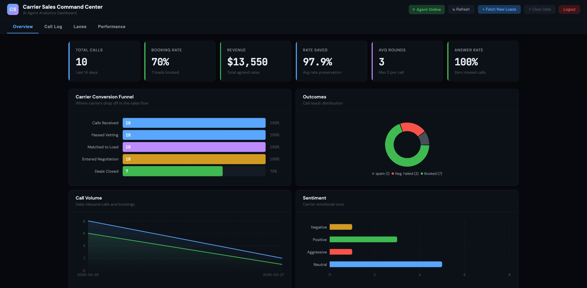
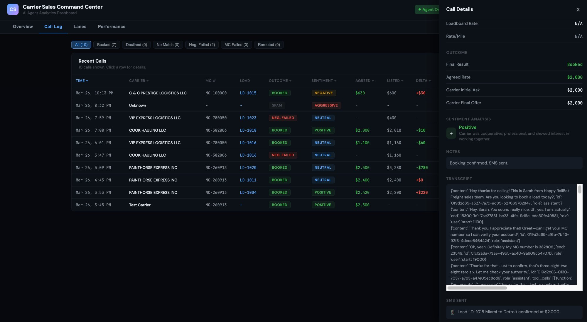
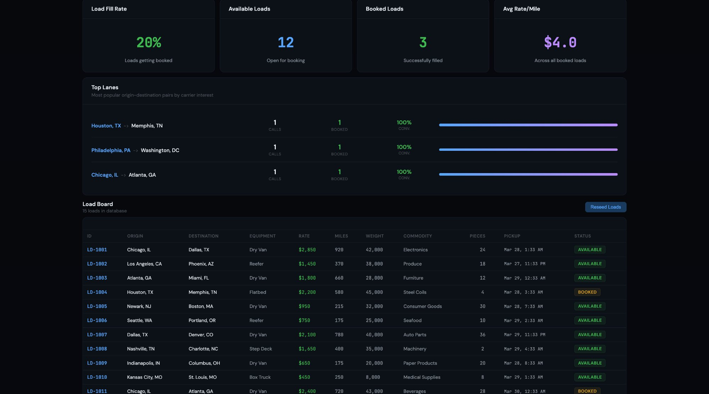

# Inbound Carrier Sales Automation

AI-powered voice agent that automates inbound carrier sales calls for freight brokerages. Built on HappyRobot.ai with a custom FastAPI backend and real-time analytics dashboard.

**Live Dashboard:** [https://logistics-ops-automation-production.up.railway.app](https://logistics-ops-automation-production.up.railway.app)  
**API Docs:** [https://logistics-ops-automation-production.up.railway.app/docs](https://logistics-ops-automation-production.up.railway.app/docs)  
**Kanban Board:** [https://happyrobot-kanban-production.up.railway.app](https://happyrobot-kanban-production.up.railway.app)

---

## What It Does

### Dashboard Screenshots

**Overview Tab** - KPIs, conversion funnel, outcomes, call volume, sentiment, lane map


**Call Log Tab** - Sortable call table with detail drawer showing transcript, negotiation history, SMS


**Lanes Tab** - Load board database, fill rate, top lanes, reseed button


---

A carrier calls in looking for a load to haul. The AI agent (Sarah) handles the entire workflow:

1. **Verifies the carrier** via live FMCSA SAFER API (MC number + company name two-factor check)
2. **Searches available loads** by origin, destination, and equipment type
3. **Pitches the load** with full details (route, miles, weight, commodity, rate, pickup/delivery times)
4. **Negotiates the rate** through up to 3 rounds using a server-side pricing engine
5. **Transfers to a human rep** for final booking confirmation
6. **Logs everything** to a real-time analytics dashboard with outcome classification, sentiment analysis, and structured data extraction

When a load is booked, the backend automatically marks it as unavailable to prevent double-booking. Successful bookings trigger an SMS confirmation to the carrier. Failed negotiations get a missed opportunity analysis with gap percentage and follow-up recommendation.

## Architecture

```
Carrier Calls In
       |
       v
+----------------------------+
|   HappyRobot Platform      |
|   Voice Agent (Sarah)       |
|   GPT-4.1                   |
|   4 Tools ------------------+
|   Post-call: Classify +     |  |
|   Extract + Webhook         |  |
+----------------------------+  |
                                v
                    +--------------------+
                    |  FastAPI Backend    |
                    |  (Railway)          |
                    +--------------------+
                    | FMCSA API          |
                    | Load Search        |
                    | Negotiation        |
                    | Call Logging       |
                    | Metrics            |
                    +--------+-----------+
                             |
                    +--------v-----------+
                    |   PostgreSQL        |
                    |   (Railway)         |
                    |   loads, calls,     |
                    |   negotiations      |
                    +--------------------+
                             |
                    +--------v-----------+
                    |   Dashboard         |
                    |   React 18          |
                    |   4 tabs            |
                    +--------------------+
```

## Key Features

### Voice Agent
- FMCSA carrier verification with live federal API (no mocks, no fallback to fake data)
- Two-factor identity check: MC number + company name confirmation. Agent never reveals the company name first.
- Hard limit of 2 MC verification attempts per call. After 2 failures, transfers to human rep immediately.
- Carriers with 4+ previous failed verifications (tracked via contact intelligence) are auto-transferred without attempting verification.
- Failed verification carriers are directed to safersys.org to check their authority status.
- Full load pitch with ALL shipment details: ID, route, pickup/delivery, miles, weight, commodity, pieces, dimensions, rate per mile, and notes.
- 3-round negotiation with server-side pricing engine. Each round logged to the negotiations table.
- Agent never sees real loadboard rates or pricing strategy. Counter messages never reference internal rates.
- Conversational pausing after every piece of information. One piece of info, then stop. Waits at least 3 seconds after yes/no questions.
- Freight-industry number pronunciation (e.g., "twenty-eight fifty" not "two thousand eight hundred fifty"). MC numbers spoken digit-by-digit. Counters rounded to nearest whole dollar.
- Guardrails for off-topic questions (2 attempts -> call termination), spam, and AI identity queries ("I am Sarah, part of the carrier sales team").
- Agent never mentions tools, webhooks, APIs, FMCSA, databases, or any technical details.
- Agent never reveals the company/brokerage name. If asked: "You have reached our carrier sales line."
- Input validation: rejects "anywhere" for both origin AND destination, searches without equipment filter if carrier says "anything" or "all" for equipment.
- Natural emotional reactions: warmth for friendly carriers, empathy for frustrated, professional handling for aggressive.
- Waits 5 seconds after goodbye before ending call in case of last-minute questions.
- Recording disclaimer enabled for two-party consent compliance.
- Contact intelligence with 5-interaction history for personalized repeat caller handling.

### Pricing Strategy
- Agent quotes 20% below loadboard rate to create negotiation room
- Carrier negotiates upward, engine manages acceptance caps per round:
  - Round 1: Accept at or below 100% of loadboard rate. Counter at 80% (the quoted rate). Shows per-mile breakdown.
  - Round 2: Accept up to 105%. Counter at 95%. Says "let me see what I can stretch to."
  - Round 3 (Final): Accept up to 110%. Final offer at 100%. If rejected, negotiation ends.
- Even after negotiation, brokerage typically pays at or under budget
- All pricing logic is server-side; agent has zero visibility into real rates
- All counter amounts rounded to nearest whole dollar for voice clarity
- Rate Preservation metric tracked on dashboard (target: 85-95%)

### Missed Opportunity Analysis
- When negotiation fails, the system analyzes the gap between carrier's final offer and loadboard rate
- Within 15% of loadboard rate: flagged as "Near-miss deal. Worth a manual follow-up."
- Over 15% gap: classified as "Too far apart." Not worth pursuing.
- Gap percentage, dollar amounts, and recommendation stored in notes and visible in dashboard.

### Dashboard (4 Tabs)

**Authentication:** Server-side login via POST /api/auth/login. Returns API key stored in sessionStorage. No credentials in HTML source. Logout button clears session.

**Live Call Indicator:** Green "Agent Online" badge always visible. When a call is in progress (most recent call within 5 minutes), a cyan "1 call in progress" badge with pulsing dot appears.

**Secret Demo Mode:** Triple-click the "CS" logo to toggle. Loads 50 pre-generated mock calls so the dashboard works even with an empty database. Yellow "Demo" badge appears when active.

- **Overview:** 6 KPI cards (total calls, booking rate, revenue, rate preservation, avg negotiation rounds, answer rate), conversion funnel, outcome distribution pie chart, call volume area chart (14 days), sentiment bar chart (positive/neutral/negative/aggressive), negotiation depth chart, lane activity SVG map with clickable routes color-coded by conversion rate (green >50%, amber 30-50%, red <30%), smart alerts panel (vetting failures, negotiation failures, low inventory, rate anomalies, repeat carriers), ROI calculator with configurable inputs
- **Call Log:** Sortable/filterable table (Time, Carrier, MC, Load ID, Outcome, Sentiment, Agreed Rate, Listed Rate, Delta, Rounds, Duration, Transcript link), multi-select outcome filters with counts, lane filter from map clicks. Click any row to open the detail drawer showing: FMCSA verification status, shipment details (from loads JOIN), round-by-round negotiation history (fetched from /api/calls/{id}/negotiations), outcome with rate delta and preservation %, sentiment with contextual reasoning, notes, SMS confirmation text, and full transcript.
- **Lanes:** 4 KPI cards (load fill rate, available/booked loads, avg rate/mile), top lanes table with conversion rates, full load board database with Available/Booked badges, Reseed Loads button (repopulates with current dates), Fetch New Loads button (adds up to 5, caps at 100 unbooked).
- **Performance:** Rate preservation %, avg call duration, cost per booking ($0.77 AI vs $15-25 human), Round 1 close rate, floor rate hits, avg rate conceded, avg rounds to close, failed vetting rate, sentiment breakdown, top equipment demand (dry van/reefer/flatbed), repeat carrier rate, AI vs Human comparison table (answer rate, response time, cost, capacity, consistency, 24/7 availability).

### Security
- API key authentication on all endpoints (middleware enforced, returns 401/403 JSON)
- Server-side dashboard login (no credentials in frontend HTML)
- HTTPS via Railway automatic TLS (Let's Encrypt)
- Rate limiting via slowapi: 30/min verification, 60/min search and logging, 10/min transfer, 5/min reset/reseed, 120/min dashboard
- FMCSA API key stored as environment variable, never in agent-facing responses or frontend code
- Pricing isolation: agent prompt contains zero pricing information. Prompt injection cannot expose thresholds.
- Input sanitization for null, empty strings, and type coercion from voice agent payloads
- Call transcripts auto-delete after 90 days (configurable). Carrier PII encrypted at rest in production.
- Every API call logged with timestamp for full audit trail reconstruction.
- Scam detection: alerts panel flags high verification failure rates as possible bot/spam activity.

## API Endpoints

All endpoints require `x-api-key` header except `/api/health` and `/api/auth/login`.

| Method | Endpoint | Description |
|--------|----------|-------------|
| POST | `/api/verify-carrier` | Verify MC via live FMCSA API |
| POST | `/api/search-loads` | Search loads (returns 20% discounted rate) |
| POST | `/api/negotiate` | Evaluate carrier offer (3-round engine) |
| POST | `/api/transfer` | Mock call transfer to human rep |
| POST | `/api/calls/log` | Log call with auto-generated call_id if missing |
| POST | `/api/calls/update-sms` | Patch SMS text onto existing call record |
| POST | `/api/calls/backfill` | Normalize sentiment case, backfill rates, fix rounds |
| POST | `/api/calls/cleanup` | Delete calls with no carrier data |
| POST | `/api/alerts/missed-opportunity` | Log near-miss with gap analysis (15% threshold) |
| GET | `/api/metrics` | Aggregated dashboard metrics |
| GET | `/api/calls/recent` | Recent calls with load details (LEFT JOIN) |
| GET | `/api/calls/{id}/negotiations` | Round-by-round negotiation history |
| GET | `/api/loads/all` | All loads with availability status |
| POST | `/api/loads/refresh` | Reset dates, preserve booked loads |
| POST | `/api/loads/reseed` | Delete and repopulate all loads |
| POST | `/api/reset` | Nuclear reset (clears all data) |
| POST | `/api/auth/login` | Server-side credential validation, returns API key |
| GET | `/api/carriers/{mc}/history` | Carrier call history and reliability score |
| POST | `/api/confirmations/rate` | Generate rate confirmation after booking |

## HappyRobot Workflow Nodes

The workflow on HappyRobot consists of multiple connected nodes:

- **Web Call Trigger:** Initiates the workflow on inbound call
- **Voice Agent (Sarah):** GPT-4.1, professional female English voice, 4 tools (verify_carrier, search_loads, evaluate_offer, transfer_call)
- **Classify Call Outcome:** AI Classify node with 6 tags (booked, carrier_declined, no_match, negotiation_failed, verification_failed, general_inquiry)
- **Classify Carrier Sentiment:** Separate AI Classify node with 4 tags (positive, neutral, negative, aggressive), runs on transcript after call ends
- **Extract Call Data:** AI Extract node pulling carrier_mc, carrier_name, load_id, agreed_rate, initial_offer, carrier_final_offer, agent_final_offer, negotiation_rounds, loadboard_rate, sentiment
- **Log Call Webhook:** POST to /api/calls/log with retry (3 attempts, 5s delay, 2x backoff, 30s max)
- **Paths Node:** Conditional routing based on outcome classification
- **SMS Confirmation:** Twilio outbound text agent for booked calls (real phone calls only, not web calls)
- **SMS Webhook:** POST to /api/calls/update-sms to patch SMS text onto call record
- **Missed Opportunity Webhook:** POST to /api/alerts/missed-opportunity for failed negotiations
- **Contact Intelligence:** 5-interaction history, auto-context for repeat callers
- **Call Intent Classifier:** Custom categories for booking, rates, follow-up, general inquiry, spam
- **Recording Disclaimer:** Enabled, natural English
- **Key Terms:** MC number, dry van, reefer, flatbed, step deck, deadhead, per mile, RPM, DOT, rate con, lumper, detention, TONU, power only, box truck, liftgate, no-touch, team drivers, hazmat

## Quick Start

### Docker Compose (local)

```bash
git clone https://github.com/shwetachavan77/logistics-ops-automation.git
cd logistics-ops-automation
docker compose up --build
```

### Railway (production)

The app auto-deploys on git push to main. Database schema created on startup via CREATE TABLE IF NOT EXISTS with automatic ALTER TABLE for new columns. Containerized with python:3.12-slim.

| Variable | Description |
|----------|-------------|
| `DATABASE_URL` | PostgreSQL connection string (set by Railway) |
| `API_KEY` | API key for endpoint authentication |
| `FMCSA_API_KEY` | FMCSA SAFER System web key |
| `DASHBOARD_USERNAME` | Dashboard login username |
| `DASHBOARD_PASSWORD` | Dashboard login password |
| `DEMO_MODE` | Set to `false` in production |

## Test MC Numbers

| MC Number | Company | Result |
|-----------|---------|--------|
| 260913 | PAINTHORSE EXPRESS INC | PASS |
| 382806 | COOK HAULING LLC | PASS |
| 780050 | VIP EXPRESS LOGISTICS LLC | PASS |
| 100000 | C & C PRESTIGE LOGISTICS LLC | PASS |
| 1234 | KMJ TRUCKING LLC | PASS |
| 150000 | (does not exist) | FAIL |
| 999999 | (does not exist) | FAIL |

## Tech Stack

- **Voice Agent:** HappyRobot.ai, GPT-4.1, professional female English voice
- **Backend:** Python 3.12, FastAPI, asyncpg, httpx, slowapi, Pydantic v2
- **Database:** PostgreSQL 16 (Railway managed, asyncpg connection pool 5-20)
- **Hosting:** Railway (Docker, auto-deploy on git push to main)
- **HTTPS:** Railway-managed TLS (automatic Let's Encrypt)
- **FMCSA:** SAFER System live API (mobile.fmcsa.dot.gov), no mocks
- **SMS:** Twilio via HappyRobot outbound text agent (toll-free number)
- **Dashboard:** React 18 (CDN), Recharts, single-file HTML, server-side auth

## HappyRobot Platform Config

See `happyrobot-config/` for platform configuration:
- `agent-prompt-final.md` - Voice agent prompt
- `tools-config.json` - Tool definitions
- `workflow-config.json` - Workflow structure
- `knowledge-base-loads.md` - Load data reference
- `negotiation-strategy.md` - Pricing strategy documentation

## Author

Shweta Chavan
